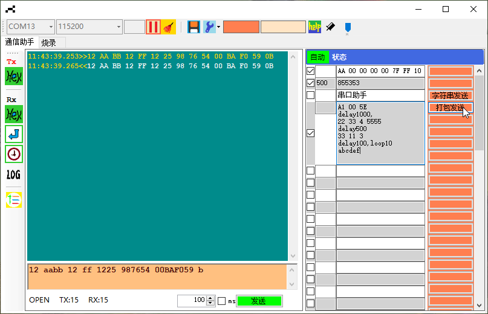

# SerialAssistant
# 概述
* 两种通信方式：串口、TCP Client  
* 具有**多级发送列表**，支持**数据打包**、循环的发送模式  
* 发送列表支持**新建、加载、另存为**  
* 窗体**可置顶**，可调透明度  
* 接收区可编辑，隐藏类似命令提示符的功能  

---

# 主界面



---

# 多级发送列表
## 结构


| HEX发送 | 延时时间 | 数据框 | 发送按键  
| ---------- | -----------|
| √ | 500 | 31 32 32 35 | 指令1  


## 编辑发送按键
数据框写入按键名，**双击数据框，完成按键命名**

## 数据打包发送
数据框中编辑：  
```
A1 04 C9 EF
delay1000,
33113
delay100,loop3
```  
单击发送按键，数据收发测试如下：
```
13:54:21.951>>A1 04 C9 EF
13:54:22.036<<A1 04 C9 EF
13:54:23.074>>33 11 03
13:54:23.099<<33 11 03
13:54:23.584>>33 11 03
13:54:23.619<<33 11 03
13:54:24.125>>33 11 03
13:54:24.225<<33 11 03
```  

## 自动循环发送
* **填好延时时间**，单击发送列表状态栏的**自动**按键，启动循环模式
* 未填写延时时间的，循环时会自动跳过

